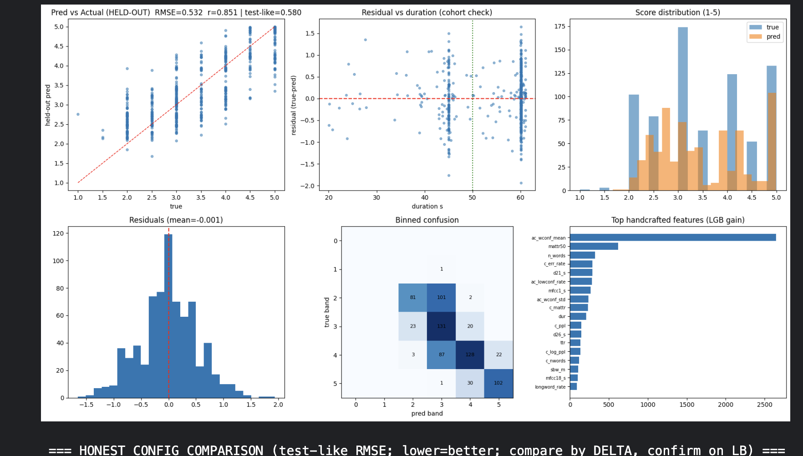

# SHL Hiring Assessment 2026 — Grammar Scoring

Predict a continuous grammar score (1–5 MOS) for 45–60 second spoken-English `.wav` clips.
[Kaggle competition](https://www.kaggle.com/competitions/shl-hiring-assessment-2026) · 769 train / 216 test · scored on RMSE and Pearson correlation.

The whole thing runs top-to-bottom on a Kaggle GPU (T4) notebook: **[`solution_v6.ipynb`](solution_v6.ipynb)**.

## Results

The submission uses the in-range labels only (732 rows), predictions clipped to [1, 5]:

| Metric | Value |
|---|---|
| Held-out RMSE (random CV) | 0.534 |
| Held-out RMSE (duration-matched to test) | 0.580 |
| Held-out Pearson | 0.851 |
| Best public LB | 0.4263 |

A note on the numbers: the held-out figures are measured with the blend weights **and** the
calibration fit inside each fold — nothing is scored on rows it was trained on — so they're honest
rather than in-sample.

## Approach

With only ~730 usable labels, fine-tuning a large audio model end-to-end just overfits. So I freeze
several feature extractors and stack a light regressor on top of them. The feature families:

- **ASR confidence** (from Whisper decoding) — by far the strongest single signal.
- **Verbatim CTC transcript** (`facebook/wav2vec2-large-960h`, greedy) — Whisper "cleans up" grammar,
  so a raw CTC transcript recovers the error signal Whisper smooths away.
- **Whisper transcript → linguistics** — perplexity, error rate, type-token ratio, sentence/word length, POS ratios.
- **Fluency** (De-Jong style) — pause and speech-rate features.
- **Acoustic** — MFCCs, spectral stats, duration.
- **SSL embeddings** — wav2vec2 + WavLM, PCA-compressed.

**Model:** a stack of LightGBM (L2 and Huber), Ridge, SVR (RBF) and ExtraTrees, combined with a
non-negative least-squares blend and an isotonic calibration on top. Predictions clipped to [1, 5].

## Two data facts the notebook is built around

1. **37 training labels are 0** — a contiguous, louder, batch-normalised block that sits outside the
   1–5 rubric. The test IDs and audio look nothing like it, so those 37 are treated as an anomaly. The
   notebook trains with and without them and scores both on the same in-range targets, instead of assuming.
2. **Train is 60s-dominant, test is 45s-dominant**, and duration correlates with score. A plain random
   CV isn't test-like, so the notebook also reports an RMSE reweighted to match the test's duration mix.

On top of that, the blend weights and calibration are fit inside each fold (held out), so the reported
numbers aren't in-sample.

## What the numbers said

- Dropping the zeros, adding a grammar specialist, or removing the CTC features each moved the score by
  less than fold noise (~0.011). The model is stable and near its ceiling for this feature set.
- ASR confidence carries ~29% of the tree model's gain; the verbatim-CTC block ~9%.
- The honest blend leans on the two linear models (SVR + Ridge ≈ 0.79 of the weight).
- Where it struggles: it compresses the range (rarely predicts a clean 1 or 5), it's weaker on the
  short clips that dominate the test set, and it over-rates fluent-sounding but ungrammatical answers.

## Files

| Path | What |
|---|---|
| `solution_v6.ipynb` | The full solution — run this. |
| `submission.csv` | Final submission (216 rows, keyed to `test.csv`). |
| `report_v6.png` | Visualisations from the notebook's report section. |
| `requirements.txt` | Dependencies. |

## How to run

1. New Kaggle notebook → upload `solution_v6.ipynb`.
2. Add the `shl-hiring-assessment-2026` competition dataset, turn on the GPU T4 accelerator and Internet.
3. Run All. It writes `submission.csv` (216 rows) and the report figure.

## Notes

- Key the submission against `test.csv`'s 216 filenames, **not** `sample_submission.csv` (it has 204 mismatched rows).
- Predictions are clipped to [1, 5]; the test set has no zero labels.
- On Kaggle Py3.12, the `openai-whisper` and `praat-parselmouth` wheels fail to build — use faster-whisper / HF Transformers instead.
- For wav2vec2/CTC, filter out chunks shorter than the conv kernel and wrap inference in try/except.
